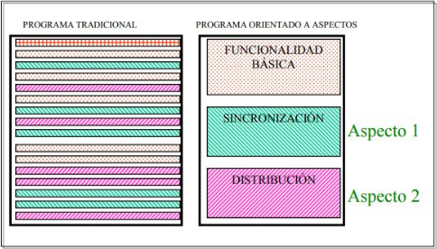
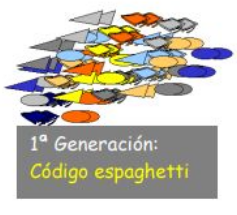
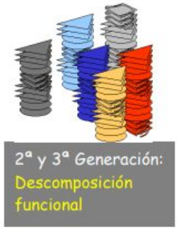
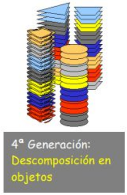
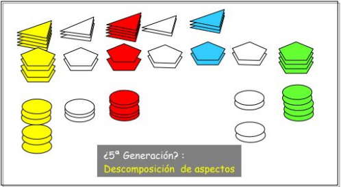
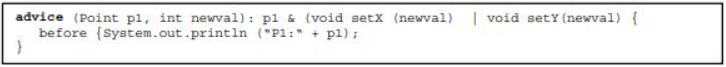
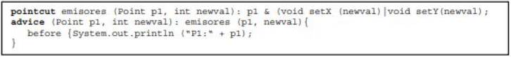

[Link del video](https://www.youtube.com/watch?v=ZzOXQ26AkDk)

[Link de la página](http://ferestrepoca.github.io/paradigmas-de-programacion/poa/poa_teoria/index.html)

[Link tutorial de AspectJ](http://ferestrepoca.github.io/paradigmas-de-programacion/poa/tutoriales/aspectJ/index.html)

* **Resumen creado por:** Guiselle Tatiana Zambrano Penagos
* **Fecha de Creación:** 27 de Enero de 2020

# Programación Orientada a Aspectos - POA
* La POA es in paradigma de programación cuya intención es permitir una adecuada
modularización y posibilitar una mejor separación de conceptos.
* La POA basa su filosofía en tratar las obligaciones transversales de nuestros
programas como módulos separados (aspectos).

* La programación orientada a objetos tiene un enfoque donde priman as clases,
en cambio en la POA, si alguna funcionalidad se repite en diferentes módulos, lo
mejor será extraerla del programa principal y crear un aspecto.

## Historia

### Generaciones del código

#### Primera Generación del código

**Código espaguetti**. El código tenía una estructura compleja, se utilizaban
sentencias _GoTo(#line)_ y _Return(#Line)_ entre otros.

**Software = Datos (Formas) + Funciones (Colores)**

#### Segunda y Tercera Generación
* Conviven disitintos datos en conjunto, pero la descomposición del sistema se
hace en base a las funciones
* Los datos quedan esparcidos por todos los conjuntos.
* Existe una agrupación que facilita la comprensión del código
* En trabajos a menor escala es bastante útil, sin embargo al crecer el tamaño
de estos, su filosofía se queda corta.
* El lenguaje C se evidencia este tipo de implementación.

**Software = Datos (Formas) + Funciones (Colores)**

#### Cuarta Generación - Descomposición en Objetos - POO

* Existe el enfoque en los datos, ya que la agrupación está basada en ellos.
* Las funcionalidades, pese a estar agrupadas, se encuentran dispersas por
los diferentes conjuntos.
* Los conjuntos representan objectos que relacionamos con la vida real, 
facilitando su comprensión para el programador.
* Se solucionan la mayoría de problemas de las generaciones pasadas, pero surgen
problemas de seguridad, optimización, performance, entre otros.
* Es el más implementado en el desarrollo de software.

**Software = Datos (Formas) + Funciones (Colores)**

#### Descomposición de Aspectos

* Los conjuntos se construyen teniendo en cuenta, tanto las funciones como los
datos.
* Las distintas funcionalidades están relacionadas.
* ¿Complica más la POO? No en realidad.

**Software = Datos (Formas) + Funciones (Colores)**

### Personas destacadas
* El concepto fue introducido por **Gregor Kiczales** junto a un grupo de 
colegas en _Xerox PARC_, desarrollaron **AspectJ**, una extensión para Java.

* **Cristina Lopes** propuso la sincronización y la invocación remota como 
nuevos bloques. Es parte del grupo _Demeter_. Antes de ser profesora, trabajó
como científica investigadora en _Xerox PARC_, allí fue conocida como la 
fundadora del grupo que desarrollo la POA.

* **Karl Lieberherr** es un científico de la computación que a mediados de los
80's empieza su investigación en la POA, enfocado en los problemas del diseño
de software y la modularidad. Crea el grupo _Demeter_ y crea los sistemas
_Demeter/Flavors_, _Demeter/C++_, _DemeterJ_, entre otros.

## Conceptos Básicos

### Aspecto
_"Un aspecto es una **unidad modular** que se disemina por la estructura de 
otras unidades funcionales. Los aspectos existen tanto en la etapa de diseño 
como en la implementación. Un **aspecto de diseño** es una unidad modular del
diseño que se entremezcla en la estructura de otras partes del diseño. Un 
**aspecto de programa o de código** es una unidad modular del programa que 
aparece en otras unidades modulares del programa."_ (G. Kiczales)

### Punto de Enlace (Join Point)

Es una clase especial de interfáz entre los aspectos y los módulos del lenguaje
de componentes. Son los lugares del código en los que éste se puede aumentar
con comportamientos adicionales. Estos comportamientos se especifican en los
aspectos.

### Avisos (Advice)

Definen partes de la implementación del aspecto que se ejecutan en puntos bien
definidos. Estos puntos pueden ser **cortes con nombre** o **cortes anónimos**.
En la siguiente figura se puede ver un advice declarado de manera anónima.

El corte es lo que está antes de los corchetes.

El cuerpo de un aviso se puede añadir en distintos puntos del código, cada uno
de los cuales se define mediante una palabra clave:
* **Aviso Before:** Se ejecuta justo antes de que lo hagan las acciones 
asociadas con los eventos del corte.
* **Aviso After:** Se ejecuta justo después de que lo hayan hecho las acciones
asociadas con los eventos del corte.
* **Aviso Catch:** Se ejecuta cuando durante la ejecución de las acciones
asociadas con los eventos definidos en el corte se ha evaluado una **excepción**
del tipo definido en la propia cláusula catch.
* **Aviso Finally:** Se ejecuta justo después de la ejecución de las acciones
asociadas con los eventos del corte, **incluso aunque se haya producido una
excepción** durante la misma.
* **Aviso Around:** Atrapan la ejecución de los métodos designados por el 
evento. La acción originas asociada con el mismo se puede invocar utilizando
**thisJoinPoint.runNext()**.

### Cortes (PointCut)
* Captura colecciones de eventos en la ejecución de un programa. Estos eventos
pueden ser invocaciones de métodos, invocaciones de constructores, y 
señalización y gestión de excepciones. **Los cortes no definen acciones,
simplemente describen eventos**.
* Un corte está formado por una parte izquierda y una derecha, **separadas**
ambas por **dos puntos**. En la parte **izquierda** se define el **nombre del
corte** y el **contexto del corte**. La parte **derecha** define los **eventos**
del corte.

Antes de que se ejecute el PointCut, se ejecuta el advice.

### Introducciones

Se utilizan para introducir elementos completamente nuevos en las clases dadas.
Entre estos elementos podemos definir:
* Un nuevo método de clase.
* Un nuevo constructor.
* Un atributo.
* Varios de los elementos anteriores a la vez.
* Varios de los elementos anteriores en varias clases.

### Tejedor

Se encarga de mezclar los diferentes mecanismos de abstracción y composición que
aparecen en los lenguajes de aspectos y componentes ayudándose de los puntos de
enlace.

Las clases y los aspectos se pueden entrelazar de dos formas distintas:
* **Entrelazado estático:** Implixa modificar el código fuente de una clase
insertando sentencias en estos puntos de enlace. El código del aspecto se 
introduce en el de la clase.
* de manera dinámica.

## Modelos Join Point

## Implementación

## Comparación con otros paradigmas

## Problemas al adoptar el paradigma

## Lenguajes de Aspectos de Propósito General vs Dominio Específico

## Ejemplos AspectJ

