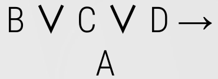
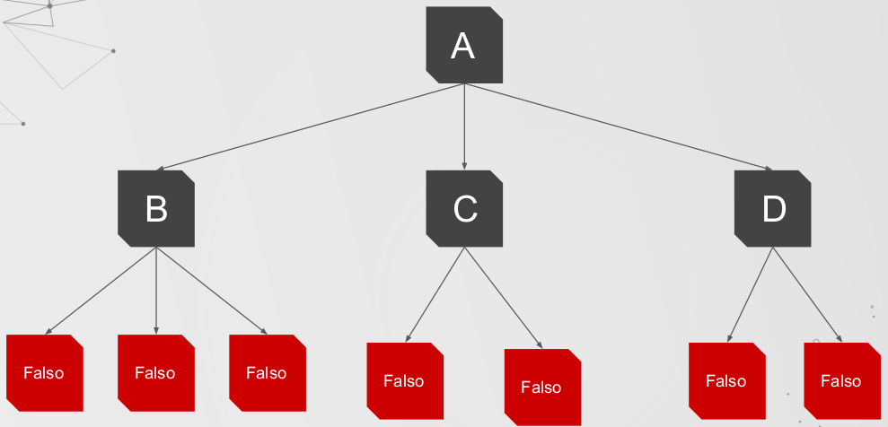
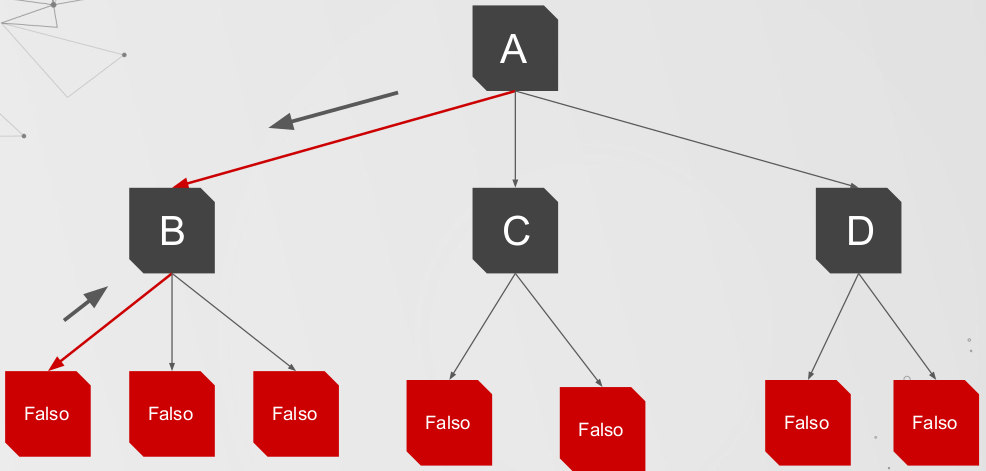
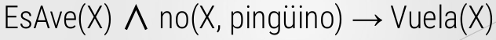
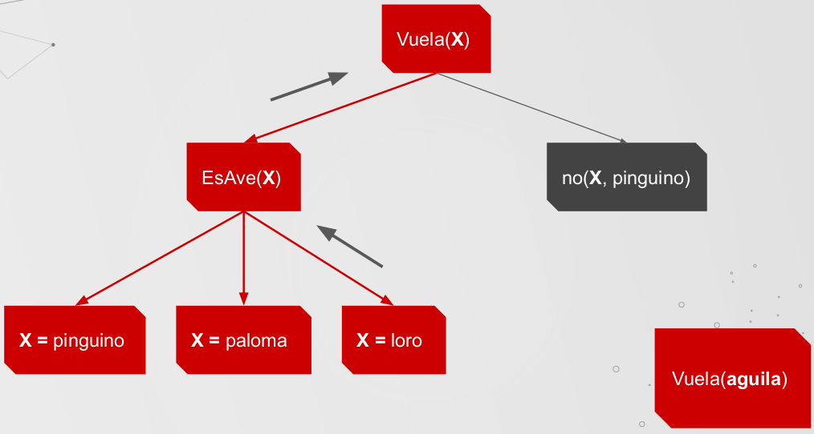
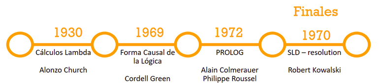

[Link del video en youtube](https://www.youtube.com/watch?v=83hw-e2z2Xg)

[Link de la página](http://ferestrepoca.github.io/paradigmas-de-programacion/proglogica/logica_teoria/introduccion.html)

* **Resumen creado por:** Guiselle Tatiana Zambrano Penagos
* **Fecha de creación:** 26 de Enero de 2020

# Programación Lógica

## Clasificación de lenguajes de programación
* **Imperativos:** _¿**Cómo** resolver un problema?_.
Lenguaje donde las instrucciones se ejecutan una tras otra de manera secuencial, 
salvo cuado se encuentra con estructuras de control, condicionales o bucles. 
Hay declaraciones de variables, tipos y procedimientos, aunque varia en función
del lenguaje.
**Ejemplos:** Go, Basic y PHP.
	* Programación Modular. Orientado a Objetos.
	* Por procedimientos
	* Procesamiento paralelo

* **Declarativos:** _¿**Qué** hacer para resolver el problema?_.Basados más en
las matemáticas y en la lógica, más cercanos al razonamiento humano. No suele 
haber declaración de variables ni tipos. Se usa para resolver problemas mediante
sentencias. 
**Ejemplos:** Lisp, Prolog y SQL.
	* Funcionales
	* Lógicos
	* Programación reactiva. (Paradigma enfocado en el trabajo con flujos de
	datos finitoso infinitos de manera **asincrona**).
	* Lenguajes descriptivos.
	* Relacionales

## Paradigma de programación lógica
* *"La programación lógica permite modelar problemas por medio de la abstracción,
utilizando un sistema de lógica formal con la cual llegar a una conclusión por
medio de hechos y reglas."*
* *"La lógica es la manera más sencilla para el intelecto humano, de expresar
formalmente problemas complejos y de resolverlos mediante la aplicación de 
reglas, hipótesis y teoremas."*

### ¿Qué trata de resolver?
Dado un problema S, saber si la proposición lógica A, es solución o no de dicho
problema o en cuáles casos lo es.

{ width=50% }\ 

* **Componente Lógico:** Indica los hechos y reglas para representar un
conocimiento
* **Componente de Control:** Deducción lógica para dar respuestas o suluciones.

### Carácterísticas del paradigma
* Unificación de terminos.
* Utilización de mecanismos de inferencia automática. Tambien conocidos como 
motores de inferencia.
* Recursión como estructura de control básica.
* Visión lógica (matemática) de la computación.

## Conceptos claves
La mayoría de los lenguajes de programación lógica se basan en la teoría lógica
de primer orden, aunque también incorporan algunos comportamientos de orden
superior.

Lógica Proposicional $\subset$ Lógica de primer orden $\subset$ Lógica de
orden superior

{ width=50% }\

### Conceptos de lógica
* **Proposición:** Sentencia lógica que puede ser verdadera o falsa; atómica o
compuesta.
* **Lógica simbólica:** Proposiciones, relaciones entre estas, inferencia.
* **Cálculo de predicados:** Tipo de lógica simbólica usado en programación 
lógica.

**Ejemplo:**

{ width=50% }\ 

* **Correcto:**
	* S
	* (P ^ Q) => ¬ R
* **Incorrecto:**
	* True ^ False = False
	* 2 + 3 => 5

### Otros conceptos importantes
* **Hecho:** Conjunto de datos que conoce el sistema a priori (o que va
adquiriendo a lo largo de la ejecución).
* **Reglas:** Conjunto de operaciones que se pueden aplicar a los hechos para
sacar un resultado lógico.
* **Base de conocimiento:** Combinación entre hechos y reglas; es todo lo que ya
estamos seguros de saber.

### Lógica de primer orden

* **Características:**
	* Más expresiva de la lógica proposicional.
	* Incluye proposiciones lógicas, predicados y cuantificadores.

* **¿Qué son?:** Es un sistema formal diseñado para estudiar la inferencia en 
lenguajes de primer orden

* **Utilidad:** La lógica del primer orden tiene el poder expresivo suficiente
para definir a prácticamente todas las matemáticas.

Al añadirle cuantificadores, variables, predicados y funciones a la gramática
previamente vista, esta queda de la siguiente forma:

{ width=50% }\ 

* **Predicados:** Qué se afirma de un objeto. Funciones sobre objetos que se 
usan para expresar propiedades o relaciones entre éstos.
* **Variables:** De quién se afirma.
* **Cuantificadores:**

{ width=50% }\ 

### Lógica de Orden Superior

Es una extensión de la lógica de primer orden, en la que se permite reducir
conjuntos (como podrían ser proposiciones, relaciones o funciones) a una 
variable sobre la cual se puede expresar nuevas proposiciones o hacer uso de los
cuantificadores. Así se expande el poder expresivo del lenguaje sin tener que
agregar nuevos símbolos lógicos.

{ width=40% }\ 

### Cláusulas de Horn

Secuencia de literales (disyunción de literales) que contiene a lo sumo uno de
sus literales positivos.

{ width=30% }\ 

### Unificación y Backtracking

Los programas en Prolog se componen de cláusulas de Horn que constituyen reglas
del tipo "modus ponendo ponens", es decir **Si es verdad el antencedente,
entonces es verdad el consecuente**.

{ width=10% }\ 

Los siguientes conceptos se imaginarán que trabajan sobre un arbol.

* **Unificación:** A partir de un punto de elección (nodo del arbol)
se determina un subconjunto de cláusulas susceptibles de ser ejecutadas,
(hojas a partir del nodo seleccionado) estas a su vez son puntos de
elección.

* **Backtracking:** Si el objetivo de la unificación es falso (hojas del arbol
del camino escogido), se deshace todo lo ejecutado hasta antes de llegar al 
punto de elección para empezar un nuevo proceso.

Para entender estos conceptos, ver el siguiente ejemplo:

{ width=20% }\ 

El arbol se construiría de la siguiente manera:

{ width=50% }\ 

**A** es el nodo raiz, **B, C, D** son nodos hijos, los cuales están compuestos
de otros nodos. El arbol de recorre de izquierda a derecha, como se ve en la
siguiente imagen.

{ width=50% }\ 

Si la hoja a la que se llega por el camino seleccionado resulta ser falsa, se
utiliza el backtracking para devolverse al nodo previo y evaluar el siguiente
nodo.

{ width=50% }\ 

* **Motor de Inferencia:** Es utilizado para inferir los resultados a partir de
hechos y reglas. Este motor depende de una **base de conocimientos**, si esta no
posee los suficientes datos, este motor no será confiable.

Ejemplo:

{ width=30% }\ 

El arbol será, el siguiente:

{ width=50% }\ 

Si el nodo _EsAve_ no posee los suficientes datos, retornará un _False_ si se 
evalua con un dato que no contempla en su base de conocimientos.

* **Recursion:** Especificación de un algoritmo basado en su propia definición.
Permite obtener resultados a partir de la definición de un caso base y llamadas
recursivas.

## Ventajas y desventajas

### Ventajas

* Expresiones simples y precisas de los problemas. (En forma de hechos y 
premisas).
* Optimización al modificar el componente de control sin modificar la lógica del
algoritmo.
* La base de conocimiento es facilmente escalable.
* Sencillez en la implementación de estructuras complejas.

### Desventajas

* **Su inferencia está limitada totalmente por su base de conocimiento.**
* No existen herramientas de depuración efectivas.
* Áreas de aplicación muy específicas.
* No resulta muy adecuada para representar cuertos problemas del mundo real.

## Lenguajes de programación lógica

### Prolog
* Es el lenguaje más representativo de la programación lógica.
* Se basa en la lógica de **primer orden**.
* Está basado en cláusulas de Horn.
* Es un lenguaje de programación declarativo.

## Aplicaciones de la programación lógica

* **Sistema Experto:** Es un sistema informático que simula el proceso de
aprendizaje.
* **Inteligencia Artificial:** Está ligado con los sistemas expertos, ya que 
algunos de ellos se concideran inteligencia artificial.
* Comprobación automática de teoremas.
* Reconocimiento o procesamiento de lenguaje natural.

## Historia
Uno de los precursores de la lógica matemática fue Aristóteles (384-322 a.c.)
con su teoría silogística, la cual estudia una clase particular de implicaciones
con dos premisas y una conclusión.

Dos siglos después el matemático George Boole (1815-1864) dio un paso importante
en el sistema de razonamiento aristotélico relacionando la lógica y el álgebra.

En la mitad del siglo XX, Alan Turing genera un avance sobre las "máquinas de
calcular" en el artículo titulado "¿Pueden pensar las máquinas?" publicado en
1950.

El primer momento en el que se usa la lógica matemática para representar y
ejecutar programas es en **1930** cuando aparece como una característica de los
**cálculos lamba** desarrollados por **Allonxo Church**.

La primerla propuesta para usar la _forma causal de la lógica_ para representar
programas de cómputo fue propuesta por **Cordell Green** en **1969** utilizando
_LISP_ (familia de lenguajes de programación).

A principios de los 70's en a Universidad de _Aix-Marseille I_ (Francia) fue
ideado el lenguaje de programación **PROLOG** por los estudiantes **Alain
Colmerauer** y **Philipper Roussel**. La verción definitiva apareció en 
**1972**.

A finales de los 70's **Robert Kowalski** crea el método de prueba por 
refutación que emplea el algoritmo de unificación como mecanismo de base y 
permite la extracción de respuestas **SLD** (Selective Linear Definite clause
resolution).

{ width=70% }\
