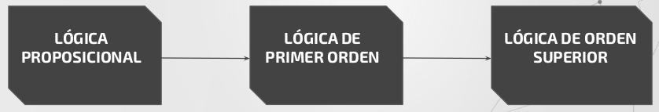

[Link del video en youtube](https://www.youtube.com/watch?v=83hw-e2z2Xg)

# Programación Lógica

## Clasificación de lenguajes de programación
* **Imperativos:** Lenguaje donde las instrucciones se ejecutan una tras otra de
manera secuencial, salvo cuado se encuentra con estructuras de control,
condicionales o bucles. Hay declaraciones de variables, tipos y procedimientos
aunque varia en función del lenguaje.
**Ejemplos:** Go, Basic y PHP.
	* Orientado a Objetos
	* Por procedimientos
	* Procesamiento paralelo

* **Declarativos:** Basados más en las matemáticas y en la lógica, más cercanos
al razonamiento humano. No se enfoca en **cómo** hacer una cosa, sino **qué**
hacer, a diferencia de los imperativos. No suele haber declaración de variables
ni tipos. Se usa para resolver problemas mediante sentencias. 
**Ejemplos:** Lisp, Prolog y SQL.
	* Funcionales
	* Lógicos
	* Relacionales

## Paradigma de programación lógica
* *"La programación lógica permite modelar problemas por medio de la abstracción,
utilizando un sistema de lógica formal con la cual llegar a una conclusión por
medio de hechos y reglas."*
* *"La lógica es la manera más sencilla para el intelecto humano, de expresar
formalmente problemas complejos y de resolverlos mediante la aplicación de 
reglas, hipótesis y teoremas."*

### ¿Qué trata de resolver?
Dado un problema S, saber si la proposición lógica A, es solución o no de dicho
problema o en cuáles casos lo es.

* **Componente Lógico:** Indica los hechos y reglas para representar un
conocimiento
* **Componente de Control:** Deducción lógica para dar respuestas o suluciones.

### Carácterísticas del paradigma
* Unificación de terminos.
* Utilización de mecanismos de inferencia automática. Tambien conocidos como 
motores de inferencia.
* Recursión como estructura de control básica.
* Visión lógica (matemática) de la computación.

## Conceptos claves
La mayoría de los lenguajes de programación lógica se basan en la teoría lógica
de primer orden, aunque también incorporan algunos comportamientos de orden
superior.

### Conceptos de lógica
* **Proposición:** Sentencia lógica que puede ser verdadera o falsa; atómica o
compuesta.
* **Lógica simbólica:** Proposiciones, relaciones entre estas, inferencia.
* **Cálculo de predicados:** Tipo de lógica simbólica usado en programación 
lógicao.

**Ejemplo:**

* **Correcto:**
 * S
 * (P ^ Q) => ¬ R
* **Incorrecto:**
 * True ^ False = False
 * 2 + 3 => 5

### Otros conceptos importantes
* **Hecho:** Conjunto de datos que conoce el sistema a priori (o que va
adquiriendo a lo largo de la ejecución).
* **Reglas:** Conjunto de operaciones que se pueden aplicar a los hechos para
sacar un resultado lógico.
* **Base de conocimiento:** Combinación entre hechos y reglas; es todo lo que ya
estamos seguros de saber.

### Lógica de primer orden

* **Características:**
 * Más expresiva de la lógica proposicional.
 * Incluye proposiciones lógicas, predicados y cuantificadores.

* **¿Qué son?:** Es un sistema formal diseñado para estudiar la inferencia en 
lenguajes de primer orden

* **Utilidad:** La lógica del primer orden tiene el poder expresivo suficiente
para definir a prácticamente todas las matemáticas.

Al añadirle a la gramática previamente vista cuantificadores, variables, 
predicados y funciones. 

* **Predicados:** Qué se afirma de un objeto. Funciones sobre objetos que se 
usan para expresar propiedades o relaciones entre éstos.
* **Variables:** De quién se afirma.
* **Cuantificadores:**

### Lógica de Orden Superior

Es una extensión de la lógica de primer orden, en la que se permite reducir
conjuntos (como podrían ser proposiciones, relaciones o funciones) a una 
variable sobre la cual se puede expresar nuevas proposiciones o hacer uso de los
cuantificadores. Así se expande el poder expresivo del lenguaje sin tener que
agregar nuevos símbolos lógicos.

### Cláusulas de Horn

Secuencia de literales (disyunción de literales) que contiene a o sumo uno de
sus literales positivos.

### Unificación y Backtracking

Los programas en Prolog se componen de cláusulas de Horn que constituyen reglas
del tipo "modus ponendo ponens", es decir **Si es verdad el antencedente,
entonces es verdad el consecuente**.

Los siguientes conceptos se imaginarán que trabajan sobre un arbol.

* **Unificación:** A partir de un punto de elección se determina un subconjunto
de cláusulas susceptibles de ser ejecutadas, estas a su vez son puntos de
elección.

* **Backtracking:** Si el objetivo de la unificación es falso (hojas del arbol
del camino escogido), se deshace todo lo ejecutado hasta antes de llegar al 
punto de elección para empezar un nuevo proceso.

## Ventajas y desventajas

## Lenguajes de programación lógica

## Aplicaciones de la programación lógica
