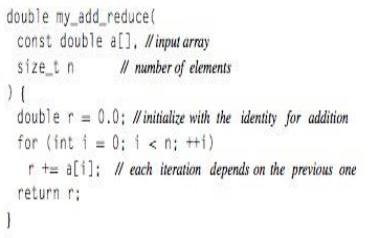

[link de la presentación en youtube](https://www.youtube.com/watch?v=Qb0_xnTgibI)
# Programación Paralela

## Introducción

Se distingue de la computación secuencial en que varias operaciones pueden
ocurrir simultaneamente. El paralelismo se emplea en el diseño de programas
eficientes en el ámbito científico, los cuales requieren una gran capacidad de
procesamiento y de espacio de memoria. Otro uso es la generación de gráficas
por coputadora.

Surge porque es natural pensar en paralelo en ciertos procesos cotidianos.

## Filosofía del paradigma

* **Serializar:** Dividir un problema muy grande en tareas a las que se le 
asigna un número de secuencia y son atendidas una destrás de la otra por un 
procesador

/

* **Parametrizar:** Dividir un problema muy grande en problemas más pequeños que
puedan ser ejecutados concurrentemente (al mismo tiempo), que a su vez son 
divididos en tareas más pequeñas y son ejecutadas por varios procesadores en un
mismo periodo de tiempo. Los recursos pueden estar asignados de 2 formas 
distintas:

	* Una única máquina ejecutando procesos en 4-8 nucleos distintos.
	* Un número arbitrario de máquinas conectadas entre sí a través de una red.

/

## Conceptos clave

Lo fundamental en un algoritmo son:

* **Tareas:** Opera sobre los datos (modificandolos o creandolos), en la
computación paralela deben ser administradas y coordinadas, se debe tener
cuidado con la **dependencia** entre los datos y las de control
	* **Dependencia de datos:** Una tarea no puede ser ejecutada antes de la
	otra.
	* **Dependencia de control:** Sucede cuando hay una sentencia que evalúa
	una condición y otras sentencias cuya ejecución dependen del resultado de 
	dicha evaluación.
* **Datos:** Representaciones simbólicas de un determinado atributo o variable.

Otros conceptos importantes son:

* **Hilos:** Son un proceso liviano que ayuda a la realización de un proceso
más pesado, se comunican entre ellos a través una memoria global. 

/

* **Granularidad:** Se refiere al tamaño de cada tarea y la dependencia entre
ellas.
	* **Granularidad gruesa:** Pocas tareas que tienen mucho trabajo entre 
	ellas, hay poca dependencia entre las tareas. No necesita gran 
	sincronización.
	* **Granularidad fina:** Muchas tareas que tienen poco trabajo y hay mucha
	dependencia entre ellas. Necesitan gran sincronización.

/

* **Sincronización:** En qué momento realizo las tareas para satizfacer las
dependencias.

* **Scheduling:** Si hay varios procesos que se pueden realizar inmediatamente
se le deben asignar los recursos computacionales necesarios, este trabajo lo
realiza el scheduling.

* **Grafo computacional y sección crítica:** El grafo computacional es un grafo
que representa la secuencia de las tareas a realizar en un programa y la
**sección critica** es el **camino más largo que existe** y que debe ser 
recorrido a la hora de ejecutar el programa.

/

* **Ley de ahmdal:** Indica que tanto se puede mejorar la velocidad de 
ejecución de un programa, limitandolo con el porcentaje del programa que pueda
ser ejecutado en paralelo.

* **Condiciones de carrera:** Sucede cuando el resultado de múltiples procesos
depende del orden de su llegada y si no son correctamente sincronizados, puede
producirse una corrupción de datos.

## Ventajas y Desventajas

* **Ventajas**

	* Las tendencias de hardware apuntan al apoyo del paralelismo.
	* Con el paralelismo podemos resolver un mayor número de problemas, que de
	otra manera no se podría resolver en una sola CPU.
	* Podemos acelerar la ejecucíon de los programas en general. (obtención
	acelerada de resultados).

* **Desventajas**

	* Mayor cantidad de unidades de procesamiento **->** Mayor consumo de 
	energía.
	* Necesidad de procesos de sincronización. (Mayor dificultad a la hora de
	programar).

## Modelos de Programación paralela

### Memoria compartida

Es el módelo más sencillo. Todos los procesos tienen el mismo acceso a la 
memoria, no hay "dueños" de los datos. Sin embargo se hace dificil el manejo de
datos locales, lo que puede llevar a produci las **condiciones de carrera**.

/

### Modelo con Hilos

Se divide una tarea compleja en varias que son menos complejas, se ejecutan al
mismo tiempo y luego se unen cuando ya tienen la respuesta cada una. Esto es
en un mismo servidor.

/

### Memoria distribuida

Los procesos se pueden ubicar en una o varias máquinas. Los procesos 
intercambian datos por medio de las funciones _sen()_ y _recive()_.

### Datos paralelos

Existe una estructura de datos común, puede ser un arreglo, una  matriz, etc,
donde están almacenados los datos y se ejecutan los procesos en paralelo.
Hacen sus tareas en diferentes particiones de la estructura, con el fin de 
evitar las condiciones de carrera.

### Modelos Híbridos

Se fucionan cualquiera de los modelos descritos previamente. En el siguiente
ejemplo se tiene un modelo de **memoria distribuida** en donde en cada servidor
actúa por si solo un **modelo con hilos**.

## Patrones de control paralelos

Seriales | Paralelos
-- | --
Secuencial	| Fork-join
Iteración	| Map
Selección	| Stencil
Recursión	| Scan
--			| Recurrencia
--			| Reducción 

### Seriales
* **Secuencial:** Una tarea detrás de la otra.
* **Iteración:** Ciclos.
* **Selección:** Condicionales.
* **Recursión:** Se especifica un proceso basado en su propia definición.

### Paralelos

#### Map

Se utiliza cuando se le hace una operación independiente a cada elemento de una
estructura de control. 

Por ejemplo, si en la unidad superior se le desea sumar
2 unidades a cada elemento, estas operaciones se pueden hacer en paralelo, dando
como resultado un vector de salida representado por la unidad inferior.

#### Stencil 

Generalización del patrón **Map**, en donde el proceso no solo va a tener acceso
al elemento central, sino también a sus vecinos. 

Por ejemplo, si se desea replicar una matriz, con la diferencia de que el valor
replicado es el resultado del elemento central mas el valor del número a su 
izquierda. Cada operación se puede hacer paralelamente, sin embargo se debe
tener cuidado ya que la estructura no es infinita, por lo tanto se deben manejar
adecuadamente las excepciones.

#### Recurrencia

Ciclos donde los cuerpos de la función son independientes y están sobre una 
misma estructura de datos y por lo tanto se pueden paralelizar.

#### Reducción

A través de una función combinatoria asociativa se convierte toda la entrada,
que en este caso es un vector, a un solo elemento de salida.

En el pseudocódigo se devuelve la sumatoria de todos los elementos del vector.
La **ruta crítica** es igual al tamaño del vector.

Puesto que la función es asociativa, esta se puede paralelizar, obteniendo:

#### Scan

Dobleces o **folds** que permiten reorganizar las operaciones y reducir el 
camino crítico.
Hace todas las reducciones parciales de los elementos.

En el siuiente ejemplo se quiere que el vector de salida tenga la suma de el
elemento actual y los elementos anteriores, se puede hacer una reducción
para cada uno.

Enfoque serial:

Enfoque paralelo:

## Lenguajes de Programación

* **lenguajes:**
	* Julia
	* HPF
	* LINDA

* **bibliotecas:** 
	* POSIX Threads
	* MPI
	*PVM 

* **API**
	* OpenMP
	* OpenCL
	* CUDA
